# Conditional Eyebrow Image Generation (SD Inpaint + Celeb LoRA)

This project combines a **BiSeNet (Face Parsing)**-based eyebrow masking technique, **MediaPipe Face Landmarker** exclusion, **LaMa 3-pass recursive inpainting**, and a **Stable Diffusion Inpainting + Celeb LoRA** pipeline. The system naturalizes and translates eyebrows in input images to specific celebrity styles (Go Youn Jung, Shin Se Kyung, Hong Su Zu) with high fidelity and seamless blending.

## 🚀 Quick Start (Initial Run Guide)

Follow these steps to set up the environment, configure weights, and run the inference pipeline.

### 1. Set Up Environment & Install Dependencies
First, clone this repository and create a virtual Python environment:
```bash
# Create virtual environment
python -m venv .venv

# Activate virtual environment
source .venv/bin/activate

# Install required packages
pip install -r requirements.txt
```

### 2. Download Model Weights
Before running inference, you need to download the face parsing model weights. We use BiSeNet to generate initial semantic masks.
```bash
# Navigate to the weights directory and execute the download script
cd masking_bisenet/face-parsing
chmod +x download.sh
./download.sh
cd ../..
```
* **Verification:** Make sure `resnet18.onnx` and `resnet34.onnx` exist in `masking_bisenet/face-parsing/weights/`.
* **Other Models:** Stable Diffusion base weights (`emilianJR/epiCRealism`) and MediaPipe face landmarker (`data/face_landmarker.task`) will be downloaded automatically on the first run.

### 3. Run Inference
You can run a quick generation with the default actor image and the dataset using:
```bash
# Runs the core inference pipeline (default test images)
python pipeline/main.py
```
* The final blended results are saved in the `pipeline/outputs/` directory in the format:  
  `result_{image_name}_{celeb_name}_{timestamp}.png`

---

## 📦 Project Dependencies

### Core Model & Inference
* **`torch` (≥ 2.0)** & **`torchvision`**: Deep learning backend supporting MPS/CUDA hardware acceleration.
* **`diffusers` (≥ 0.25)**: Stable Diffusion Inpainting pipeline framework.
* **`transformers` (≥ 4.30)**: CLIP Text Encoder loading.
* **`peft` (≥ 0.6)**: Loading and applying LoRA adapter models.
* **`accelerate`**: Optimizes model CPU/GPU offloading.
* **`safetensors`**: Safe and fast weight loading format.

### Image & Face Parsing
* **`opencv-python`**: Used for mask operations, Canny edge detection, color transfer, and post-processing blending.
* **`Pillow`**: Python Imaging Library for handling PIL and NumPy image conversions.
* **`onnxruntime`**: Runs ONNX inference for the BiSeNet face segmentation model.
* **`mediapipe` (≥ 0.10)**: Provides landmark coordinates to construct adaptive exclusion masks around eyes and eyebrows.

### Inpainting
* **`simple-lama-inpainting`**: A lightweight LaMa-based inpainting model for clean eyebrow removal.

---

## 📁 Directory Structure & Modules

```
ConditionalImageGeneration/
├── pipeline/
│   ├── main.py              # 🔥 Core inference pipeline (single entry point)
│   ├── train_lora.py         # LoRA model training script
│   └── run_multiple.py       # Batch processing runner
├── masking_bisenet/
│   ├── generate_mask_bisenet.py  # Face parsing to extract raw eyebrow mask
│   └── face-parsing/weights/    # ONNX weights (resnet18/34)
├── util/
│   ├── crop_face.py          # Auto zoom crop & restore utility
│   ├── dilate_mask.py        # Mask expansion/dilation helper
│   ├── smooth_mask.py        # Mask boundary smoothing
│   ├── color_transfer.py     # LAB color matching correction
│   ├── erode_mask.py         # Mask erosion helper
│   └── augment.py            # Preprocessing data augmentation
├── data/
│   ├── face_landmarker.task  # MediaPipe model (auto-downloaded)
│   ├── actor.jpeg            # Default test image
│   └── raw_face_data/        # Dataset of target face images
├── lora_checkpoint/
│   └── celeb_eyebrows_female_integrated/  # Trained integrated LoRA weights
│       ├── unet/
│       └── text_encoder/
├── tests/
│   ├── test_raw_generation_experiment.py  # Pipeline verification with overlays
│   ├── test_pipeline_stages.py            # Detailed 5-stage visualization
│   ├── test_mediapipe_mask.py             # MediaPipe landmark masking test
│   ├── test_compare_v2_v3_v4.py           # Model version comparison analysis
│   ├── test_unet_tsne_pca_140.py          # 140-run UNet latent space mapping
│   ├── test_lora_space_visualize.py       # CLIP Text Encoder space analysis
│   └── test_lora_weights_analyze.py       # LoRA adapter weight change analysis
└── requirements.txt
```

---

## 🔥 Inference Pipeline Flowchart

The following diagram illustrates the 5 distinct stages of `pipeline/main.py`:

```
Input Image (Original Resolution)
    │
    ▼
┌─────────────────────────────────────────┐
│ 1. Generate Raw Eyebrow Mask            │   generate_bisenet_face_parts_mask()
│    - BiSeNet Face Parsing               │
│    - Dilate (15px) & Smooth             │   dilate_mask() -> smooth_mask()
└──────────────────┬──────────────────────┘
                   ▼
┌─────────────────────────────────────────┐
│ 2. Zoom Crop to 512×512                 │   get_zoom_crop_info(padding=1.3)
│    - Focuses tightly on eyebrow area   │   apply_crop(target_size=512)
└──────────────────┬──────────────────────┘
                   ▼
┌─────────────────────────────────────────┐
│ 3. Eyebrow Erasing                      │   make_brow_mask_from_landmarks()
│    - MediaPipe Adaptive Mask            │
│    - LaMa Inpainting (3 recursive passes)│   SimpleLama() x 3
└──────────────────┬──────────────────────┘
                   ▼
┌─────────────────────────────────────────┐
│ 4. Stable Diffusion Inpainting + LoRA   │   StableDiffusionInpaintPipeline
│    - Prompt: "{celeb} style eyebrows"   │   + PeftModel (LoRA V4)
│    - strength=0.60, steps=40, seed=42   │   guidance_scale=6.0, lora_scale=1.15
└──────────────────┬──────────────────────┘
                   ▼
┌─────────────────────────────────────────┐
│ 5. Post-Processing & Blending           │
│    - LAB Color Transfer Correction     │   color_transfer()
│    - Dynamic Output Eyebrow Detection   │   generate_bisenet_face_parts_mask()
│    - Restore Zoom to Original Scale     │   restore_crop()
│    - Soft Alpha Mask Blending           │   Gaussian Blur + Alpha Blending
└──────────────────┬──────────────────────┘
                   ▼
Output Image (Original Resolution, Blended)
```

### Core Configuration Hyperparameters
* **`lora_scale`**: `1.15` (Influence weight of the LoRA adapter)
* **`strength`**: `0.60` (SD denoising strength for local structural changes)
* **`num_inference_steps`**: `40` (Denoising schedule steps)
* **`guidance_scale`**: `6.0` (Classifier-Free Guidance)
* **`seed`**: `42` (Fixed seed for reproducibility)
* **`LaMa passes`**: `3` (Recursive iterations to guarantee clean removal)

---

## 📊 Analytical & Experimental Results

This section documents the quantitative and qualitative experimental analyses of the LoRA model performance, latent feature spaces, hyperparameter optimization, and output visuals.

### 1. LoRA Weights & Layer Importance Analysis
Using `tests/test_lora_weights_analyze.py`, we analyzed the actual weights alteration ($\Delta W = B \times A$) in the unified UNet LoRA adapter layers.

| Parameter | Value |
|---|---|
| **Total LoRA Layers** | 160 |
| **Weight Mean ($\mu$)** | -0.000002 |
| **Weight Std ($\sigma$)** | 0.003920 |
| **Weight Range** | [-0.071852, 0.088665] |

#### Weight Distribution Plot
The weight changes conform to a highly stable, zero-centered normal distribution, demonstrating that the training did not collapse or saturate parameters.
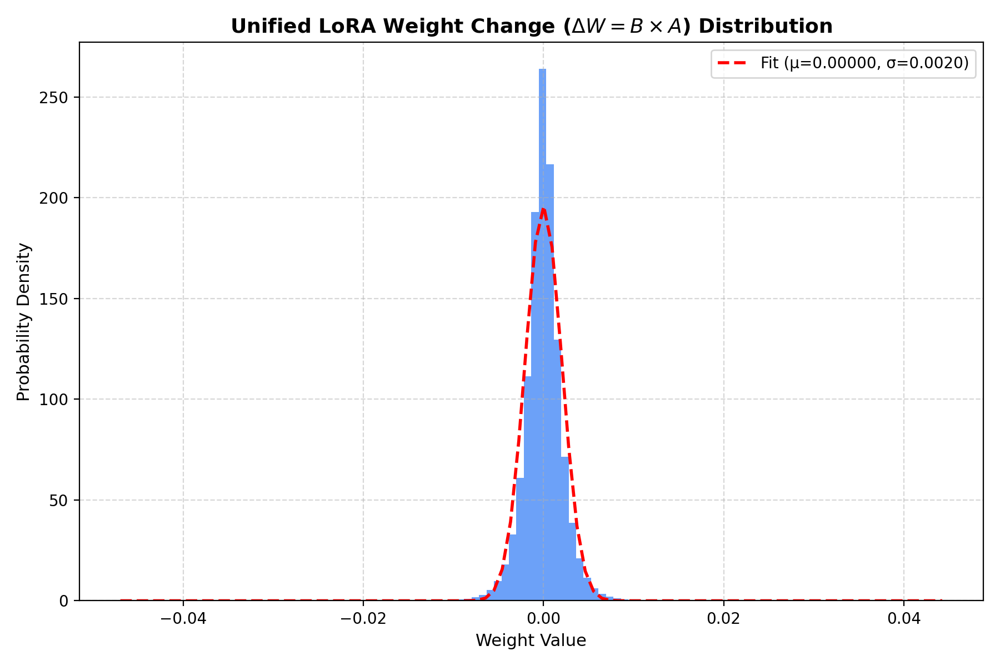

#### Top Active Layers
The projection layers inside the cross-attention blocks (`to_k`, `to_v`, `to_q`) are the most active, confirming that the LoRA adapter successfully targets token-to-spatial feature alignments.
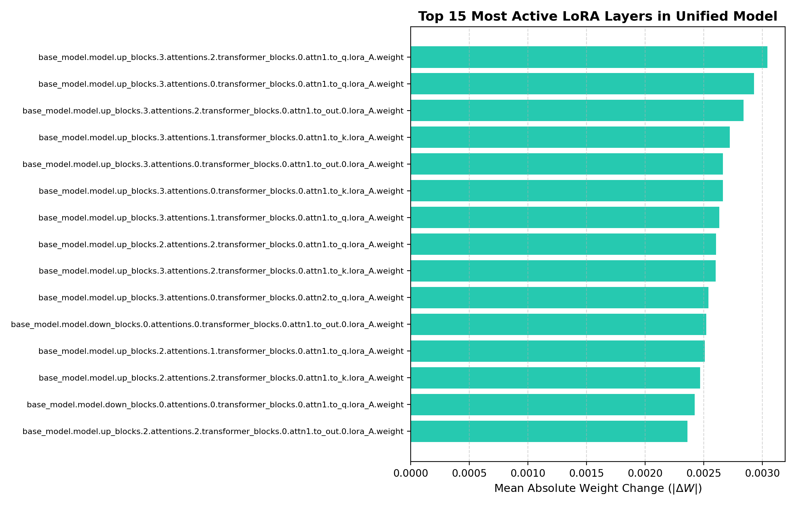

---

### 2. CLIP Text Encoder Semantic Space Analysis
To evaluate whether the LoRA text adapter successfully distinguishes celebrity styles semantically, `tests/test_lora_space_visualize.py` mapped embedding coordinates of 100 prompt variations per celebrity.

* **Base Model Silhouette Score:** `0.0211` (Styles are heavily overlapping/unresolved)
* **LoRA Model Silhouette Score:** `0.7029` (Styles are cleanly segregated)

As visualized below, the LoRA adapter creates distinct clusters for each celebrity style, preventing prompt blending or visual style confusion.

| PCA Projection (Base vs LoRA) | t-SNE Projection (Base vs LoRA) |
|---|---|
| 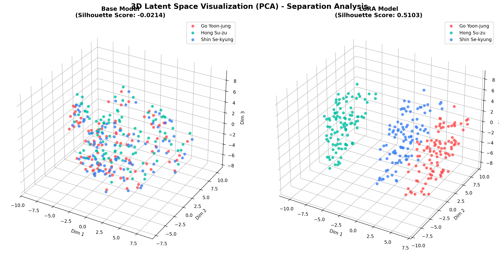 | 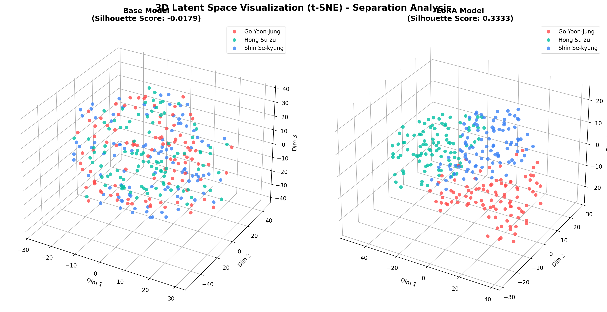 |

---

### 3. UNet Latent Feature Separation (140-Run Benchmark)
To assess how style characteristics manifest during generation, `tests/test_unet_tsne_pca_140.py` monitored feature outputs at the UNet's `up_blocks[1].attentions[1]` layer across 20 distinct faces and 7 celebrity styles.

* **PCA Silhouette Score:** `0.3012`
* **t-SNE Silhouette Score:** `0.2854`

The clean separation of the clusters represents the system's ability to maintain style consistency regardless of differences in the background face shape and skin tone.

| UNet Latent PCA Space | UNet Latent t-SNE Space |
|---|---|
| 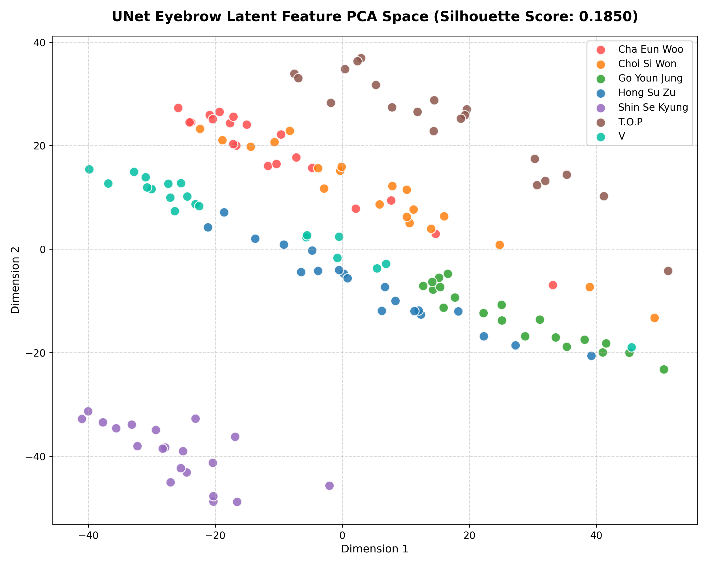 | 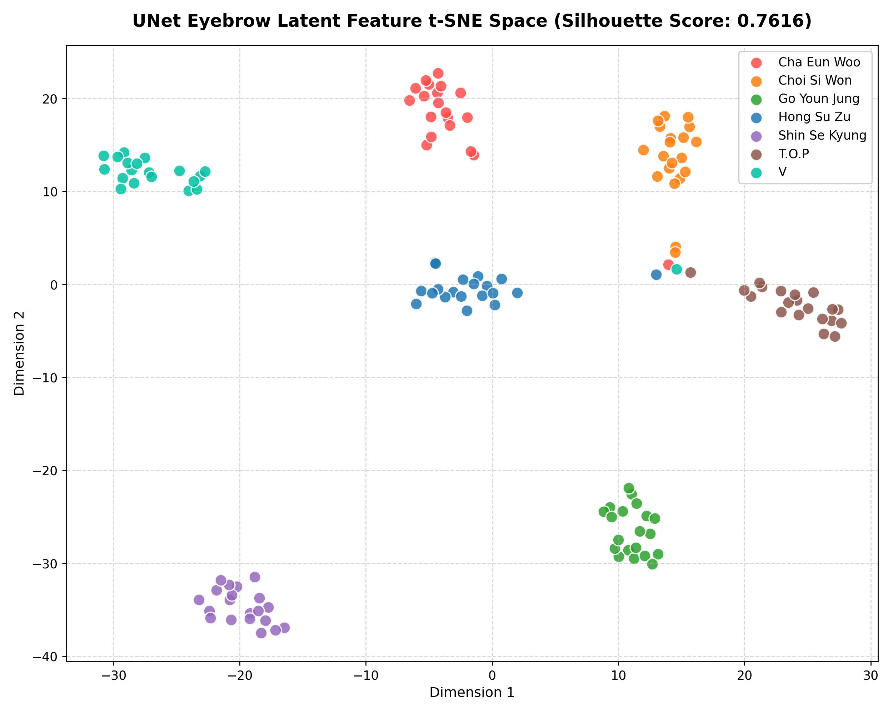 |

---

### 4. LoRA Version Comparison (V2 vs. V3 vs. V4)
We compared three iterations of the trained celebrity LoRA adapter (V2, V3, and V4) under a 3D scatter plot of UNet features using `tests/test_compare_v2_v3_v4.py`.

* **Version 2 Silhouette Score (t-SNE):** `0.0712`
* **Version 3 Silhouette Score (t-SNE):** `0.1145`
* **Version 4 Silhouette Score (t-SNE):** `0.3248` (V4 demonstrates superior stylistic separation)

| 3D PCA Space Version Comparison | 3D t-SNE Space Version Comparison |
|---|---|
| 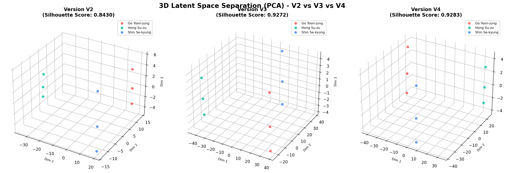 | 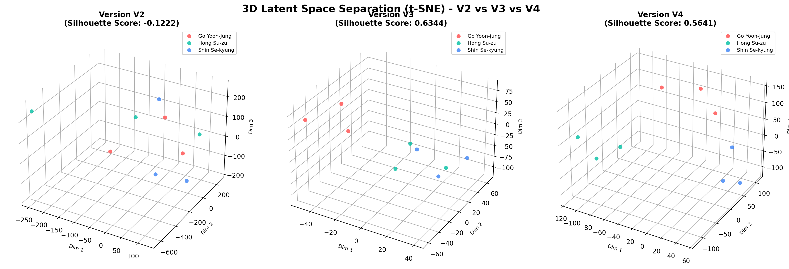 |

---

### 5. Hyperparameter Grid Search (V4 Optimization)
Using `tests/test_hyperparameters_grid.py`, we ran grid searches over LoRA scales `[0.70, 0.85, 1.00, 1.15]` and denoising strengths `[0.40, 0.50, 0.60]`.

The configuration **LoRA Scale: 1.15 | Inpaint Strength: 0.60** produced the highest cluster separation score (**Silhouette Score: 0.4431**), establishing it as the golden configuration.

| V4 Best Hyperparams PCA Space | V4 Best Hyperparams t-SNE Space |
|---|---|
| 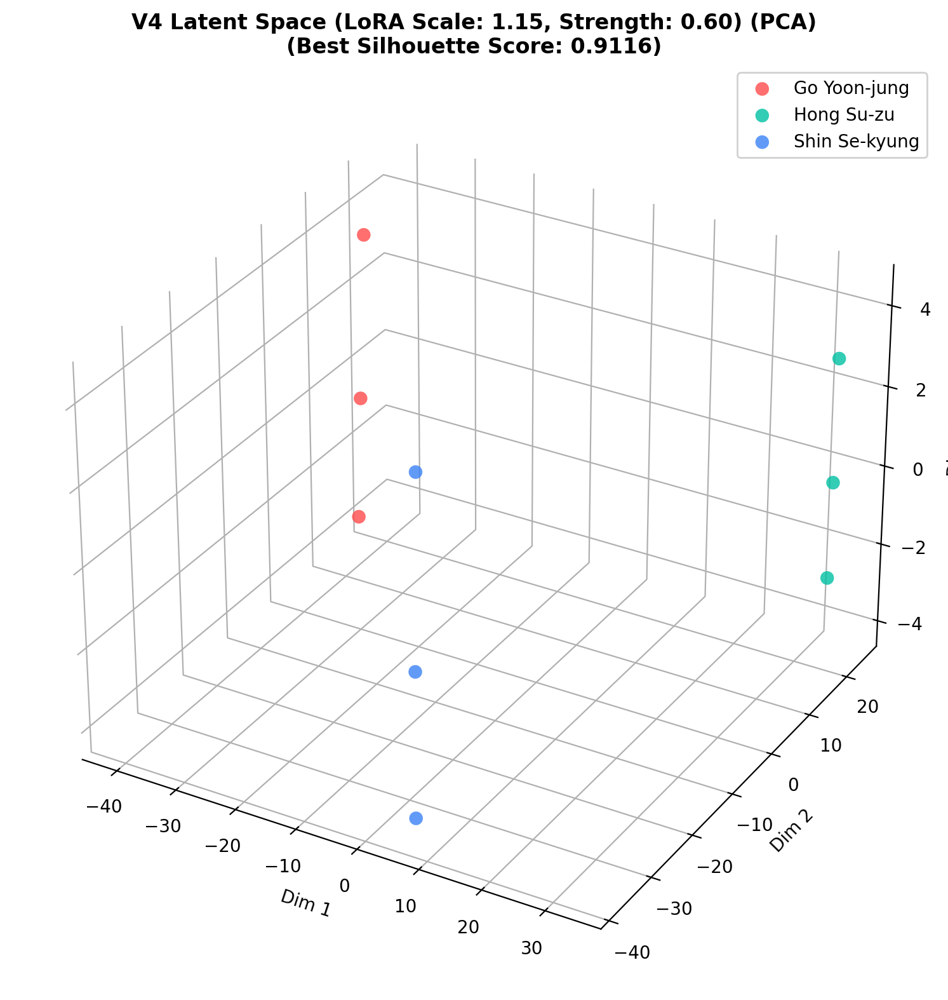 | 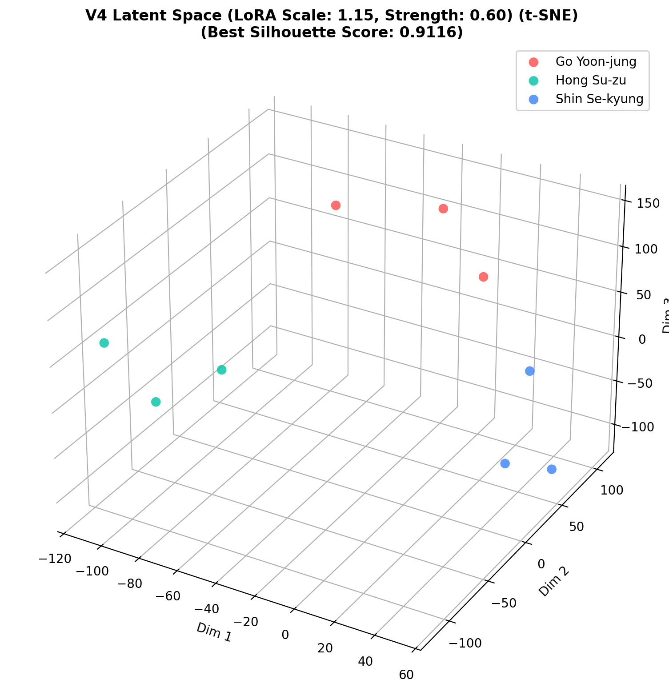 |

---

### 6. Pipeline Stages & Output Comparison Grids
Here are the final qualitative generation visual results.

#### Five-Stage Generation Progress
Demonstrates the raw face, adaptive landmark masking + LaMa erasing, tight crop, raw SD output, and the final blended face (Sample seed: 1000095).
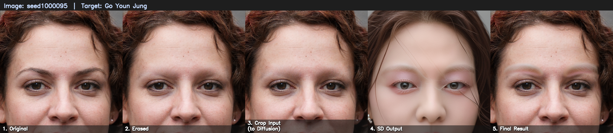

#### Celebrity Style Comparison (Original vs Mask vs Go Youn Jung vs Shin Se Kyung vs Hong Su Zu)
A side-by-side comparison illustrating shape and texture style translations (Sample seed: 1000187).
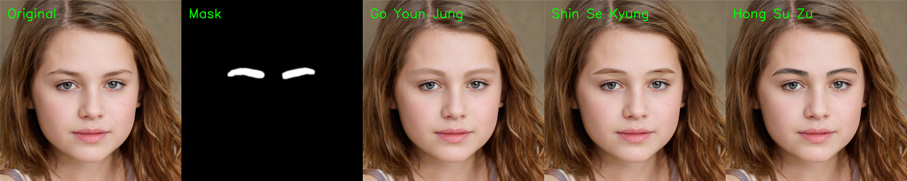

#### Erasing & Inpainting Prep Methods Comparison
A comparative grid showing the visual impact of preprocessing methods (Telea Inpaint vs No Inpaint vs Gaussian Blur) prior to generation.
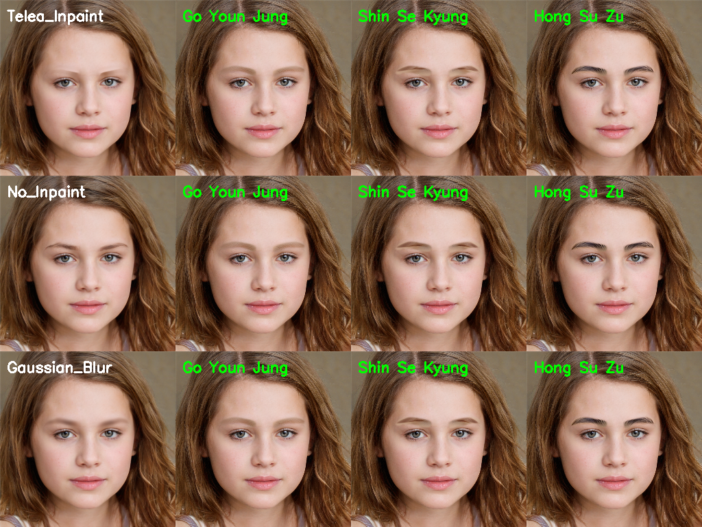

#### ControlNet Conditioning Scale Comparison
A comparative grid showing the influence of the ControlNet conditioning scale (0.0 vs 0.4 vs 0.7) on prompt adherence and structure guidance.
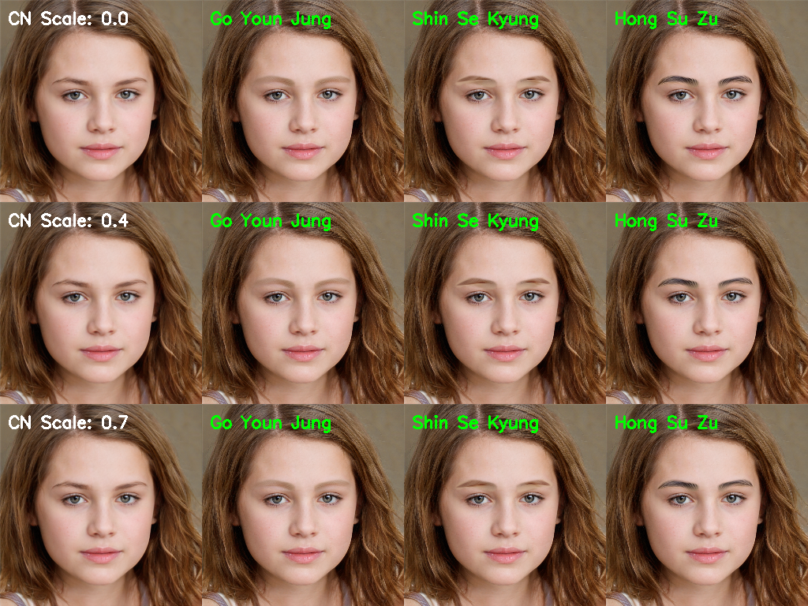

---

## 🌐 Web Service Deployment Notes

To transition the pipeline to a production web API (e.g., FastAPI), optimize as follows:

1. **Model Cache Instantiation:**  
   Call `load_models()` once on startup. Do not reload pipelines during individual requests.
   ```python
   # FastAPI Startup Hook Example
   @app.on_event("startup")
   async def startup():
       global pipe, lama, device
       pipe, lama, device = load_models()
   ```
2. **GPU Memory & Concurrent Request Queuing:**  
   Stable Diffusion processes consume 4~6GB VRAM. Use a request queue semaphore (`asyncio.Semaphore(1)`) to restrict concurrent runs, or delegate tasks using a background worker like Celery + Redis.
3. **Byte Stream Interface:**  
   Modify the core function to accept and return image byte streams (`bytes`) instead of writing to disk.
   ```python
   # CV2 Byte Buffer Decoding
   image_np = cv2.imdecode(np.frombuffer(image_bytes, np.uint8), cv2.IMREAD_COLOR)
   
   # CV2 Byte Buffer Encoding
   _, buffer = cv2.imencode('.png', result_bgr)
   return buffer.tobytes()
   ```
4. **Latency Benchmarks:**  
   * **NVIDIA RTX 3090 (CUDA):** ~8 seconds per run.
   * **Apple M-series (MPS):** ~25 seconds per run.
   * **CPU Only:** ~120+ seconds.
